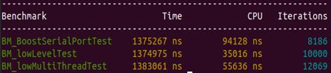

# Управление аппаратными узлами посредством COM-порта

Управление узлами через COM-порт является одной из наиболее критичных задач для управляющего ПО устройствами банковского самообслуживания. Не смотря на кажущуюся простоту задачи, с ней связано большое количество "подводных камней" и инженерных вызовов.

Разрабатывая код взаимодействия с устройством через COM-порт, имеет смысл попытаться ответить на следующие вопросы:

- Планируется ли использование разных операционных систем (Linux, Windows)?
- Будут ли команды к устройству отправляться из разных потоков исполнения (см. multi-threading)?
- Будут ли использоваться разные типы запросов, например: отправка команды на исполнение и систематический опрос состояния устройства. Если ответ "будут", то каким образом следует прерывать систематический опрос состояния устройств для отправки команд?
- Должен ли API класса работы с устройством через COM-порт быть асинхронным для прикладного программиста?
- Можно ли использовать низкоуровневый код, или следует создать переносимый, высокоуровневый код?
- Какие образом будет осуществляться борьба с зависаниями: устройства, драйвера порта?

Ответы на эти вопросы могут привести к разнообразным техническим решениям, например:

- Используются функции Windows API: CreateFile(), CloseHandle(), WriteFile(), ReadFile(). Для настройки порта используется структуры DCB и COMSTAT, функции: GetCommState(), SetCommState(), GetOverlappedResult(), SetCommTimeouts(), CancelIo()
- Используются функции потокового ввода/вывода в Linux: open(), close(), read(), write(). Для Настройки порта используется библиотека **termios**
- Используется многопоточная модель, в которой есть отдельный поток polling-а устройства с целью кэширования актуального состояния узла. Для выполнения команды используется второй поток. Коммуникационный порт является разделяемым ресурсом, доступ к которому организуется посредством объектов синхронизации операционной системы (чаще всего - mutex)

Инженерный подход предполагает формулировку критериев, на основании которых следует принимать решение о выборе конкретных технических решений. К таким критериям следует отнести:

1. Обеспечение минимального времени отклюка при выполнении обмена данными
2. Гибкость решения (простота адаптации при изменении условий использования кода)
3. Эффективное использование вычислительных ресурсов процессора и памяти
4. Простоту прикладного кода
5. Простоту реализации библиотеки для управления узлом посредством COM-порта

Критерии 4 и 5 являются субъективными. Для критериев 1-3 можно попытаться разработать методику оценки, например, используяGoogle Benchmark.

Целью данного тестового задания является экспериментальная проверка следующих утверждений:

- Расход вычислительных ресурсов при использовании высокоуровневых, переносимых библиотек (например, Boost.Asio) близок к расходу при использовании низкоуровневых вызовов API
- Асинхронный, однопочный код библиотеки управления узлом работает кратно более эфффективно, чем многопоточный код

Бонусная часть задачи - реализация способов решения проблемы с зависанием устройства/драйвера COM-порта.

# Анти-паттерны (по результатам представленных решений задач)

При анализе выполненных контрибьюторами тестовых задач был выявлен ряд **анти-паттернов**, которые рекомендуется принимать во внимание при разработке кода.

Интуитивно, более простое решение кажется более правильным и это является причиной того, что некоторые разработчики решили не использовать событийную модель для межтопочного взаимодействия, предпочитая синхронизацию через переменную, проверяемую через некоторый период времени. Исключительно негативный вариант - синхронизация через статическую переменную без модификатора **volitile**.

volatile — информирует компилятор о том, что значение переменной может измениться в другом потоке и не следует применять регистровую оптимизацию, т.е. хранить ей в регистре процессора, а не загружать из оперативной памяти при каждом использовании.

Разрабатывая программный код либо минимизируйте использование многопоточности, либо используйте событийную модель для межпоточного взаимодействия.

Рекомендуются для прочтения статья [Потоки, блокировки и условные переменные в C++11](https://habr.com/ru/post/182610/) и её [вторая часть](https://habr.com/ru/post/182626/). Под событийной моделью подразумевается использование **condition_variable** и методы **notify_one**() и **notify_all**().

# Представленные решения и выводы

Важным при решении задачи является не только сам код библиотеки, но и обоснование того, что представленное решение соответствует описанным ранее критериям. Поскольку крайне сложно (если возможно) предоставить диапазон метрик, которые будут отнозначно определять соответствие решения выдвинутым критериям качества, рекомендуется использовать сравнительные тесты. 

Одним из способов выполнения сравнения может быть применение Google Benchmark. При проведении сравнения кажется разумным выполнить следующие этапы:

1. Определить возможные варианты решения задачи
2. Выдвинуть гипотезу о том, как эти варианты должны работать
3. Получить метрики и проанализировать соответствие ожидаемого и фактического результата
4. При значительном расхождении ожиданий и результатов попытаться идентифицировать причины, скорректировать код, или гипотезу
5. Добиться соответствия ожидаемого и фактического результата
6. Зафкисировать гипотезу, результаты и выводы

## Benchmarking разных подходов при разработке библиотеки работы с COM-портом (CommPortTest)

В [решении контрибьютора](https://github.com/Muzantip/CommPortTest/tree/master) осуществляется проверка производительности трёх подходов:

- низкоуровневый однопоточный
- однопоточный с использованием асинхронного кода Boost.Asio
- многопоточный с использованием событийной модели

Изначальная гипотеза была следующей:

- Boost.Asio работает на 15-20% (_overhead_), чем низко-уровневый код, т.к. создаёт дополнительный уровень абстракции
- Многопоточность требует кратно больше ресурсов, чем однопоточный код

Полученные результаты:

Вывод по полученным результатам:

- **Asio** расходует, приблизительно, в два с половиной раза больше вычислительных ресурсов, чем низко-уровневый код, но в абсолютных цифрах расхождения не принципиальные. Рекомендуется использовать **Asio**, т.к. эта код разработанный для этой библиотеки является переносимым
- инструментальные средства (Google Benchmark) ориентирован, в первую очередь, на сравнение однопоточной производительнеости и не очень хорошо подходит для конкретной задачи - выбора решения для разработки библиотеки работы с COM-портом
